---
search:
  boost: 10.0
---

# Class: ExperimentalConditions 


_Biological and experimental conditions applicable to all trials in the dataset. Covers organism identity, treatment, assay design, and environmental parameters._


<div data-search-exclude markdown="1">


URI: [bstm:ExperimentalConditions](bstm:ExperimentalConditions)

```mermaid
 classDiagram
    class ExperimentalConditions
    click ExperimentalConditions href "../ExperimentalConditions/"
      ExperimentalConditions : age_unit
        
          
    
        
        
        ExperimentalConditions --> "0..1" DevelopmentUnitEnum : age_unit
        click DevelopmentUnitEnum href "../DevelopmentUnitEnum/"
    

        
      ExperimentalConditions : age_value
        
      ExperimentalConditions : arena_height
        
      ExperimentalConditions : arena_height_unit
        
          
    
        
        
        ExperimentalConditions --> "0..1 _recommended_" LengthUnitEnum : arena_height_unit
        click LengthUnitEnum href "../LengthUnitEnum/"
    

        
      ExperimentalConditions : arena_length
        
      ExperimentalConditions : arena_length_unit
        
          
    
        
        
        ExperimentalConditions --> "0..1 _recommended_" LengthUnitEnum : arena_length_unit
        click LengthUnitEnum href "../LengthUnitEnum/"
    

        
      ExperimentalConditions : arena_shape
        
          
    
        
        
        ExperimentalConditions --> "0..1 _recommended_" ArenaShapeEnum : arena_shape
        click ArenaShapeEnum href "../ArenaShapeEnum/"
    

        
      ExperimentalConditions : arena_type
        
          
    
        
        
        ExperimentalConditions --> "0..1 _recommended_" ArenaTypeEnum : arena_type
        click ArenaTypeEnum href "../ArenaTypeEnum/"
    

        
      ExperimentalConditions : arena_width
        
      ExperimentalConditions : arena_width_unit
        
          
    
        
        
        ExperimentalConditions --> "0..1 _recommended_" LengthUnitEnum : arena_width_unit
        click LengthUnitEnum href "../LengthUnitEnum/"
    

        
      ExperimentalConditions : assay_description
        
      ExperimentalConditions : assay_type
        
      ExperimentalConditions : body_length_unit
        
          
    
        
        
        ExperimentalConditions --> "0..1 _recommended_" LengthUnitEnum : body_length_unit
        click LengthUnitEnum href "../LengthUnitEnum/"
    

        
      ExperimentalConditions : body_length_value
        
      ExperimentalConditions : control_type
        
          
    
        
        
        ExperimentalConditions --> "0..1" ControlTypeEnum : control_type
        click ControlTypeEnum href "../ControlTypeEnum/"
    

        
      ExperimentalConditions : developmental_stage
        
          
    
        
        
        ExperimentalConditions --> "0..1" DevelopmentalStageEnum : developmental_stage
        click DevelopmentalStageEnum href "../DevelopmentalStageEnum/"
    

        
      ExperimentalConditions : developmental_stage_unit
        
          
    
        
        
        ExperimentalConditions --> "0..1" DevelopmentUnitEnum : developmental_stage_unit
        click DevelopmentUnitEnum href "../DevelopmentUnitEnum/"
    

        
      ExperimentalConditions : developmental_stage_value
        
      ExperimentalConditions : experiment_end_datetime
        
      ExperimentalConditions : experiment_notes
        
      ExperimentalConditions : experiment_start_datetime
        
      ExperimentalConditions : exposure_compound_chebi_id
        
      ExperimentalConditions : exposure_compound_name
        
      ExperimentalConditions : exposure_concentration
        
      ExperimentalConditions : exposure_concentration_unit
        
          
    
        
        
        ExperimentalConditions --> "0..1 _recommended_" ConcentrationUnitEnum : exposure_concentration_unit
        click ConcentrationUnitEnum href "../ConcentrationUnitEnum/"
    

        
      ExperimentalConditions : exposure_duration_h
        
      ExperimentalConditions : exposure_route
        
          
    
        
        
        ExperimentalConditions --> "0..1" ExposureRouteEnum : exposure_route
        click ExposureRouteEnum href "../ExposureRouteEnum/"
    

        
      ExperimentalConditions : genotype
        
      ExperimentalConditions : habituation_duration_min
        
      ExperimentalConditions : habituation_protocol
        
      ExperimentalConditions : housing_conditions
        
      ExperimentalConditions : light_cycle_detail
        
      ExperimentalConditions : light_cycle_type
        
          
    
        
        
        ExperimentalConditions --> "0..1 _recommended_" LightCycleTypeEnum : light_cycle_type
        click LightCycleTypeEnum href "../LightCycleTypeEnum/"
    

        
      ExperimentalConditions : n_individuals_per_arena
        
      ExperimentalConditions : n_individuals_total
        
      ExperimentalConditions : plate_well_count
        
      ExperimentalConditions : sex
        
          
    
        
        
        ExperimentalConditions --> "0..1 _recommended_" SexEnum : sex
        click SexEnum href "../SexEnum/"
    

        
      ExperimentalConditions : solvent_vehicle
        
      ExperimentalConditions : species_name
        
      ExperimentalConditions : species_ncbi_taxon_id
        
      ExperimentalConditions : strain
        
      ExperimentalConditions : temperature_celsius
        
      ExperimentalConditions : treatment_description
        
      ExperimentalConditions : treatment_name
        
      ExperimentalConditions : weight_unit
        
          
    
        
        
        ExperimentalConditions --> "0..1" WeightUnitEnum : weight_unit
        click WeightUnitEnum href "../WeightUnitEnum/"
    

        
      ExperimentalConditions : weight_value
        
      ExperimentalConditions : well_shape_bottom
        
          
    
        
        
        ExperimentalConditions --> "0..1" WellBottomShapeEnum : well_shape_bottom
        click WellBottomShapeEnum href "../WellBottomShapeEnum/"
    

        
      ExperimentalConditions : well_shape_cross_section
        
          
    
        
        
        ExperimentalConditions --> "0..1 _recommended_" WellCrossSectionShapeEnum : well_shape_cross_section
        click WellCrossSectionShapeEnum href "../WellCrossSectionShapeEnum/"
    

        
      
```





<!-- no inheritance hierarchy -->

## Slots

| Name | Cardinality and Range | Description | Inheritance |
| ---  | --- | --- | --- |
| [species_name](species_name.md) | 1 <br/> [String](String.md) | Scientific (Latin) binomial name of the study organism | direct |
| [n_individuals_total](n_individuals_total.md) | 1 <br/> [Integer](Integer.md) | Total number of individuals used in the experiment | direct |
| [n_individuals_per_arena](n_individuals_per_arena.md) | 1 <br/> [Integer](Integer.md) | Number of individuals tested simultaneously in the arena | direct |
| [assay_type](assay_type.md) | 1 <br/> [String](String.md) | Name of the behavioral assay paradigm or test paradigm | direct |
| [experiment_start_datetime](experiment_start_datetime.md) | 0..1 _recommended_ <br/> [Datetime](Datetime.md) | Date and time at which the experiment began | direct |
| [experiment_end_datetime](experiment_end_datetime.md) | 0..1 _recommended_ <br/> [Datetime](Datetime.md) | Date and time at which the experiment ended | direct |
| [species_ncbi_taxon_id](species_ncbi_taxon_id.md) | 0..1 _recommended_ <br/> [String](String.md) | NCBI Taxonomy ID for the study organism | direct |
| [strain](strain.md) | 0..1 _recommended_ <br/> [String](String.md) | Organism strain or line | direct |
| [genotype](genotype.md) | 0..1 _recommended_ <br/> [String](String.md) | Genotype identifier of the tracked organism(s)including  strain-specific, mut... | direct |
| [sex](sex.md) | 0..1 _recommended_ <br/> [SexEnum](SexEnum.md) | Biological sex of the tracked organism(s) | direct |
| [body_length_value](body_length_value.md) | 0..1 _recommended_ <br/> [Float](Float.md) | Body length numeric value of the tracked organism(s) | direct |
| [body_length_unit](body_length_unit.md) | 0..1 _recommended_ <br/> [LengthUnitEnum](LengthUnitEnum.md) | Body length unit of the tracked organism(s) | direct |
| [arena_shape](arena_shape.md) | 0..1 _recommended_ <br/> [ArenaShapeEnum](ArenaShapeEnum.md) | Geometric shape of the test arena | direct |
| [arena_type](arena_type.md) | 0..1 _recommended_ <br/> [ArenaTypeEnum](ArenaTypeEnum.md) | Type of the test arena, e | direct |
| [arena_length](arena_length.md) | 0..1 _recommended_ <br/> [Float](Float.md) | Length of the arena along one axis | direct |
| [arena_length_unit](arena_length_unit.md) | 0..1 _recommended_ <br/> [LengthUnitEnum](LengthUnitEnum.md) | Unit of measurement for arena_length | direct |
| [arena_width](arena_width.md) | 0..1 _recommended_ <br/> [Float](Float.md) | Width of the arena along one axis | direct |
| [arena_width_unit](arena_width_unit.md) | 0..1 _recommended_ <br/> [LengthUnitEnum](LengthUnitEnum.md) | Unit of measurement for arena_width | direct |
| [arena_height](arena_height.md) | 0..1 _recommended_ <br/> [Float](Float.md) | Height of the arena, when applicable | direct |
| [arena_height_unit](arena_height_unit.md) | 0..1 _recommended_ <br/> [LengthUnitEnum](LengthUnitEnum.md) | Unit of measurement for arena_height | direct |
| [plate_well_count](plate_well_count.md) | 0..1 _recommended_ <br/> [Integer](Integer.md) | Number of wells in the multiwell plate | direct |
| [well_shape_cross_section](well_shape_cross_section.md) | 0..1 _recommended_ <br/> [WellCrossSectionShapeEnum](WellCrossSectionShapeEnum.md) | Geometric cross section shape of the wells of a multiwell plate | direct |
| [temperature_celsius](temperature_celsius.md) | 0..1 _recommended_ <br/> [Float](Float.md) | Water or ambient temperature during the recording in degrees Celsius | direct |
| [light_cycle_type](light_cycle_type.md) | 0..1 _recommended_ <br/> [LightCycleTypeEnum](LightCycleTypeEnum.md) | Standardized category of the light-dark cycle | direct |
| [light_cycle_detail](light_cycle_detail.md) | 0..1 _recommended_ <br/> [String](String.md) | Free-text description of the light-dark cycle | direct |
| [treatment_name](treatment_name.md) | 0..1 _recommended_ <br/> [String](String.md) | Short label identifying the experimental treatment group, condition, or regim... | direct |
| [treatment_description](treatment_description.md) | 0..1 _recommended_ <br/> [String](String.md) | Full description of the treatment protocol | direct |
| [exposure_compound_name](exposure_compound_name.md) | 0..1 _recommended_ <br/> [String](String.md) | Name of the chemical, drug, or substance used in the treatment or exposure | direct |
| [exposure_compound_chebi_id](exposure_compound_chebi_id.md) | 0..1 _recommended_ <br/> [String](String.md) | ChEBI identifier for the test substance | direct |
| [exposure_concentration](exposure_concentration.md) | 0..1 _recommended_ <br/> [Float](Float.md) | Nominal exposure concentration (numeric value only; use unit field) | direct |
| [exposure_concentration_unit](exposure_concentration_unit.md) | 0..1 _recommended_ <br/> [ConcentrationUnitEnum](ConcentrationUnitEnum.md) | Unit for exposure concentration | direct |
| [developmental_stage](developmental_stage.md) | 0..1 <br/> [DevelopmentalStageEnum](DevelopmentalStageEnum.md) | Developmental stage of the tracked organism(s) | direct |
| [developmental_stage_value](developmental_stage_value.md) | 0..1 <br/> [Float](Float.md) | Numeric developmental stage value (e | direct |
| [developmental_stage_unit](developmental_stage_unit.md) | 0..1 <br/> [DevelopmentUnitEnum](DevelopmentUnitEnum.md) | Unit for developmental stage value of the tracked organism(s) | direct |
| [age_value](age_value.md) | 0..1 <br/> [Float](Float.md) | Numeric age value of the tracked organism(s) | direct |
| [age_unit](age_unit.md) | 0..1 <br/> [DevelopmentUnitEnum](DevelopmentUnitEnum.md) | Age unit of the tracked organism(s) | direct |
| [weight_value](weight_value.md) | 0..1 <br/> [Float](Float.md) | Body weight numeric value of the tracked organism(s) | direct |
| [weight_unit](weight_unit.md) | 0..1 <br/> [WeightUnitEnum](WeightUnitEnum.md) | Body weight unit of the tracked organism(s) | direct |
| [assay_description](assay_description.md) | 0..1 <br/> [String](String.md) | Free-text description of the assay protocol | direct |
| [well_shape_bottom](well_shape_bottom.md) | 0..1 <br/> [WellBottomShapeEnum](WellBottomShapeEnum.md) | Geometric bottom shape of the wells of a multiwell plate | direct |
| [habituation_duration_min](habituation_duration_min.md) | 0..1 <br/> [Float](Float.md) | Duration of habituation period before recording, in minutes | direct |
| [habituation_protocol](habituation_protocol.md) | 0..1 <br/> [String](String.md) | Description of habituation or acclimation prior to testing | direct |
| [housing_conditions](housing_conditions.md) | 0..1 <br/> [String](String.md) | Free-text description of animal housing conditions prior to assay | direct |
| [exposure_route](exposure_route.md) | 0..1 <br/> [ExposureRouteEnum](ExposureRouteEnum.md) | Route of chemical or treatment administration | direct |
| [exposure_duration_h](exposure_duration_h.md) | 0..1 <br/> [Float](Float.md) | Duration of chemical or treatment exposure in hours | direct |
| [solvent_vehicle](solvent_vehicle.md) | 0..1 <br/> [String](String.md) | Solvent or vehicle used to dissolve the test substance | direct |
| [control_type](control_type.md) | 0..1 <br/> [ControlTypeEnum](ControlTypeEnum.md) | Type of control group used | direct |
| [experiment_notes](experiment_notes.md) | 0..1 <br/> [String](String.md) | Free-text notes on experimental conditions not captured by structured fields | direct |

<details>
<summary>Expressions & Logic</summary>
#### Any Of

The class must satisfy at least one of:
- AnonymousClassExpression({
  'slot_conditions': {'developmental_stage': SlotDefinition({'name': 'developmental_stage', 'required': True})}
})
- AnonymousClassExpression({
  'slot_conditions': {'developmental_stage_value': SlotDefinition({'name': 'developmental_stage_value', 'required': True}),
    'developmental_stage_unit': SlotDefinition({'name': 'developmental_stage_unit', 'required': True})}
})
- AnonymousClassExpression({
  'slot_conditions': {'age_value': SlotDefinition({'name': 'age_value', 'required': True}),
    'age_unit': SlotDefinition({'name': 'age_unit', 'required': True})}
})

</details>


## Usages

| used by | used in | type | used |
| ---  | --- | --- | --- |
| [VTADataset](VTADataset.md) | [experimental_conditions](experimental_conditions.md) | range | [ExperimentalConditions](ExperimentalConditions.md) |


## Rules


### 

| Rule Applied | Preconditions | Postconditions | Elseconditions |
|--------------|---------------|----------------|----------------|
| slot_conditions |```{'body_length_value': {'value_presence': 'PRESENT'}}``` |```{'body_length_unit': {'required': True}}``` | |


### 

| Rule Applied | Preconditions | Postconditions | Elseconditions |
|--------------|---------------|----------------|----------------|
| slot_conditions |```{'weight_value': {'value_presence': 'PRESENT'}}``` |```{'weight_unit': {'required': True}}``` | |


### 

| Rule Applied | Preconditions | Postconditions | Elseconditions |
|--------------|---------------|----------------|----------------|
| slot_conditions |```{'arena_length': {'value_presence': 'PRESENT'}}``` |```{'arena_length_unit': {'required': True}}``` | |


### 

| Rule Applied | Preconditions | Postconditions | Elseconditions |
|--------------|---------------|----------------|----------------|
| slot_conditions |```{'arena_width': {'value_presence': 'PRESENT'}}``` |```{'arena_width_unit': {'required': True}}``` | |


### 

| Rule Applied | Preconditions | Postconditions | Elseconditions |
|--------------|---------------|----------------|----------------|
| slot_conditions |```{'arena_height': {'value_presence': 'PRESENT'}}``` |```{'arena_height_unit': {'required': True}}``` | |


### 

| Rule Applied | Preconditions | Postconditions | Elseconditions |
|--------------|---------------|----------------|----------------|
| slot_conditions |```{'light_cycle_type': {'equals_string': 'cyclic_ld'}}``` |```{'light_cycle_detail': {'required': True}}``` | |


## Identifier and Mapping Information


### Schema Source


* from schema: https://w3id.org/bestmeta/schema


## Mappings

| Mapping Type | Mapped Value |
| ---  | ---  |
| self | bstm:ExperimentalConditions |
| native | bstm:ExperimentalConditions |


## LinkML Source

<!-- TODO: investigate https://stackoverflow.com/questions/37606292/how-to-create-tabbed-code-blocks-in-mkdocs-or-sphinx -->

### Direct

<details>
```yaml
name: ExperimentalConditions
description: Biological and experimental conditions applicable to all trials in the
  dataset. Covers organism identity, treatment, assay design, and environmental parameters.
from_schema: https://w3id.org/bestmeta/schema
slots:
- species_name
- n_individuals_total
- n_individuals_per_arena
- assay_type
- experiment_start_datetime
- experiment_end_datetime
- species_ncbi_taxon_id
- strain
- genotype
- sex
- body_length_value
- body_length_unit
- arena_shape
- arena_type
- arena_length
- arena_length_unit
- arena_width
- arena_width_unit
- arena_height
- arena_height_unit
- plate_well_count
- well_shape_cross_section
- temperature_celsius
- light_cycle_type
- light_cycle_detail
- treatment_name
- treatment_description
- exposure_compound_name
- exposure_compound_chebi_id
- exposure_concentration
- exposure_concentration_unit
- developmental_stage
- developmental_stage_value
- developmental_stage_unit
- age_value
- age_unit
- weight_value
- weight_unit
- assay_description
- well_shape_bottom
- habituation_duration_min
- habituation_protocol
- housing_conditions
- exposure_route
- exposure_duration_h
- solvent_vehicle
- control_type
- experiment_notes
rules:
- preconditions:
    slot_conditions:
      body_length_value:
        name: body_length_value
        value_presence: PRESENT
  postconditions:
    slot_conditions:
      body_length_unit:
        name: body_length_unit
        required: true
  description: body_length_value requires body_length_unit
- preconditions:
    slot_conditions:
      weight_value:
        name: weight_value
        value_presence: PRESENT
  postconditions:
    slot_conditions:
      weight_unit:
        name: weight_unit
        required: true
  description: weight_value requires weight_unit
- preconditions:
    slot_conditions:
      arena_length:
        name: arena_length
        value_presence: PRESENT
  postconditions:
    slot_conditions:
      arena_length_unit:
        name: arena_length_unit
        required: true
  description: arena_length requires arena_length_unit
- preconditions:
    slot_conditions:
      arena_width:
        name: arena_width
        value_presence: PRESENT
  postconditions:
    slot_conditions:
      arena_width_unit:
        name: arena_width_unit
        required: true
  description: arena_width requires arena_width_unit
- preconditions:
    slot_conditions:
      arena_height:
        name: arena_height
        value_presence: PRESENT
  postconditions:
    slot_conditions:
      arena_height_unit:
        name: arena_height_unit
        required: true
  description: arena_height requires arena_height_unit
- preconditions:
    slot_conditions:
      light_cycle_type:
        name: light_cycle_type
        equals_string: cyclic_ld
  postconditions:
    slot_conditions:
      light_cycle_detail:
        name: light_cycle_detail
        required: true
  description: If light_cycle_type is cyclic_ld, light_cycle_detail should be provided.
any_of:
- slot_conditions:
    developmental_stage:
      name: developmental_stage
      required: true
- slot_conditions:
    developmental_stage_value:
      name: developmental_stage_value
      required: true
    developmental_stage_unit:
      name: developmental_stage_unit
      required: true
- slot_conditions:
    age_value:
      name: age_value
      required: true
    age_unit:
      name: age_unit
      required: true

```
</details>

### Induced

<details>
```yaml
name: ExperimentalConditions
description: Biological and experimental conditions applicable to all trials in the
  dataset. Covers organism identity, treatment, assay design, and environmental parameters.
from_schema: https://w3id.org/bestmeta/schema
attributes:
  species_name:
    name: species_name
    description: Scientific (Latin) binomial name of the study organism
    examples:
    - value: Danio rerio
    - value: Mus musculus
    - value: Daphnia magna
    from_schema: https://w3id.org/bestmeta/schema
    exact_mappings:
    - dwc:scientificName
    - EDAM-DATA:1045
    rank: 1000
    owner: ExperimentalConditions
    domain_of:
    - ExperimentalConditions
    range: string
    required: true
  n_individuals_total:
    name: n_individuals_total
    description: Total number of individuals used in the experiment.
    from_schema: https://w3id.org/bestmeta/schema
    rank: 1000
    owner: ExperimentalConditions
    domain_of:
    - ExperimentalConditions
    range: integer
    required: true
  n_individuals_per_arena:
    name: n_individuals_per_arena
    description: Number of individuals tested simultaneously in the arena.
    from_schema: https://w3id.org/bestmeta/schema
    rank: 1000
    owner: ExperimentalConditions
    domain_of:
    - ExperimentalConditions
    range: integer
    required: true
    minimum_value: 1
  assay_type:
    name: assay_type
    description: Name of the behavioral assay paradigm or test paradigm.
    examples:
    - value: open field test
    - value: light-dark transition
    - value: elevated plus maze
    - value: locomotor activity assay
    - value: chemobehavioral assay
    from_schema: https://w3id.org/bestmeta/schema
    broad_mappings:
    - OBI:0000070
    rank: 1000
    owner: ExperimentalConditions
    domain_of:
    - ExperimentalConditions
    range: string
    required: true
  experiment_start_datetime:
    name: experiment_start_datetime
    description: Date and time at which the experiment began.
    from_schema: https://w3id.org/bestmeta/schema
    rank: 1000
    owner: ExperimentalConditions
    domain_of:
    - ExperimentalConditions
    range: datetime
    required: false
    recommended: true
  experiment_end_datetime:
    name: experiment_end_datetime
    description: Date and time at which the experiment ended.
    from_schema: https://w3id.org/bestmeta/schema
    rank: 1000
    owner: ExperimentalConditions
    domain_of:
    - ExperimentalConditions
    range: datetime
    required: false
    recommended: true
  species_ncbi_taxon_id:
    name: species_ncbi_taxon_id
    description: NCBI Taxonomy ID for the study organism
    examples:
    - value: '7955'
    - value: '10090'
    from_schema: https://w3id.org/bestmeta/schema
    exact_mappings:
    - dwc:taxonID
    - EDAM-DATA:1179
    rank: 1000
    owner: ExperimentalConditions
    domain_of:
    - ExperimentalConditions
    range: string
    required: false
    recommended: true
    pattern: ^\d+$
  strain:
    name: strain
    description: Organism strain or line
    from_schema: https://w3id.org/bestmeta/schema
    exact_mappings:
    - EDAM-DATA:2379
    rank: 1000
    owner: ExperimentalConditions
    domain_of:
    - ExperimentalConditions
    range: string
    required: false
    recommended: true
  genotype:
    name: genotype
    annotations:
      source_ontology:
        tag: source_ontology
        value: GENO
    description: Genotype identifier of the tracked organism(s)including  strain-specific,
      mutant, transgenic, or engineered genotypes.
    from_schema: https://w3id.org/bestmeta/schema
    exact_mappings:
    - EFO:0000513
    - GENO:0000536
    rank: 1000
    owner: ExperimentalConditions
    domain_of:
    - ExperimentalConditions
    range: string
    required: false
    recommended: true
  sex:
    name: sex
    description: Biological sex of the tracked organism(s).
    from_schema: https://w3id.org/bestmeta/schema
    exact_mappings:
    - PATO:0000047
    rank: 1000
    owner: ExperimentalConditions
    domain_of:
    - ExperimentalConditions
    range: SexEnum
    required: false
    recommended: true
  body_length_value:
    name: body_length_value
    description: Body length numeric value of the tracked organism(s).
    from_schema: https://w3id.org/bestmeta/schema
    close_mappings:
    - EFO:0004339
    - MESH:D049628
    rank: 1000
    owner: ExperimentalConditions
    domain_of:
    - ExperimentalConditions
    range: float
    required: false
    recommended: true
  body_length_unit:
    name: body_length_unit
    description: Body length unit of the tracked organism(s).
    from_schema: https://w3id.org/bestmeta/schema
    rank: 1000
    owner: ExperimentalConditions
    domain_of:
    - ExperimentalConditions
    range: LengthUnitEnum
    required: false
    recommended: true
  arena_shape:
    name: arena_shape
    description: Geometric shape of the test arena.
    from_schema: https://w3id.org/bestmeta/schema
    broad_mappings:
    - OBI:0000968
    rank: 1000
    owner: ExperimentalConditions
    domain_of:
    - ExperimentalConditions
    range: ArenaShapeEnum
    required: false
    recommended: true
  arena_type:
    name: arena_type
    description: Type of the test arena, e.g., open field, multiwell plate or elevated
      plus maze.
    from_schema: https://w3id.org/bestmeta/schema
    rank: 1000
    owner: ExperimentalConditions
    domain_of:
    - ExperimentalConditions
    range: ArenaTypeEnum
    required: false
    recommended: true
  arena_length:
    name: arena_length
    description: Length of the arena along one axis.
    from_schema: https://w3id.org/bestmeta/schema
    rank: 1000
    owner: ExperimentalConditions
    domain_of:
    - ExperimentalConditions
    range: float
    required: false
    recommended: true
  arena_length_unit:
    name: arena_length_unit
    description: Unit of measurement for arena_length.
    from_schema: https://w3id.org/bestmeta/schema
    rank: 1000
    owner: ExperimentalConditions
    domain_of:
    - ExperimentalConditions
    range: LengthUnitEnum
    required: false
    recommended: true
  arena_width:
    name: arena_width
    description: Width of the arena along one axis.
    from_schema: https://w3id.org/bestmeta/schema
    rank: 1000
    owner: ExperimentalConditions
    domain_of:
    - ExperimentalConditions
    range: float
    required: false
    recommended: true
  arena_width_unit:
    name: arena_width_unit
    description: Unit of measurement for arena_width.
    from_schema: https://w3id.org/bestmeta/schema
    rank: 1000
    owner: ExperimentalConditions
    domain_of:
    - ExperimentalConditions
    range: LengthUnitEnum
    required: false
    recommended: true
  arena_height:
    name: arena_height
    description: Height of the arena, when applicable.
    from_schema: https://w3id.org/bestmeta/schema
    rank: 1000
    owner: ExperimentalConditions
    domain_of:
    - ExperimentalConditions
    range: float
    required: false
    recommended: true
  arena_height_unit:
    name: arena_height_unit
    description: Unit of measurement for arena_height.
    from_schema: https://w3id.org/bestmeta/schema
    rank: 1000
    owner: ExperimentalConditions
    domain_of:
    - ExperimentalConditions
    range: LengthUnitEnum
    required: false
    recommended: true
  plate_well_count:
    name: plate_well_count
    description: Number of wells in the multiwell plate.
    examples:
    - value: '24'
    - value: '96'
    from_schema: https://w3id.org/bestmeta/schema
    exact_mappings:
    - AFR:0002231
    rank: 1000
    owner: ExperimentalConditions
    domain_of:
    - ExperimentalConditions
    range: integer
    required: false
    recommended: true
    minimum_value: 1
  well_shape_cross_section:
    name: well_shape_cross_section
    description: Geometric cross section shape of the wells of a multiwell plate.
    from_schema: https://w3id.org/bestmeta/schema
    rank: 1000
    owner: ExperimentalConditions
    domain_of:
    - ExperimentalConditions
    range: WellCrossSectionShapeEnum
    required: false
    recommended: true
  temperature_celsius:
    name: temperature_celsius
    description: Water or ambient temperature during the recording in degrees Celsius
    from_schema: https://w3id.org/bestmeta/schema
    rank: 1000
    owner: ExperimentalConditions
    domain_of:
    - ExperimentalConditions
    range: float
    required: false
    recommended: true
    unit:
      ucum_code: Cel
  light_cycle_type:
    name: light_cycle_type
    description: Standardized category of the light-dark cycle.
    from_schema: https://w3id.org/bestmeta/schema
    rank: 1000
    owner: ExperimentalConditions
    domain_of:
    - ExperimentalConditions
    range: LightCycleTypeEnum
    required: false
    recommended: true
  light_cycle_detail:
    name: light_cycle_detail
    description: Free-text description of the light-dark cycle.
    from_schema: https://w3id.org/bestmeta/schema
    exact_mappings:
    - MESH:D017440
    rank: 1000
    owner: ExperimentalConditions
    domain_of:
    - ExperimentalConditions
    range: string
    required: false
    recommended: true
  treatment_name:
    name: treatment_name
    description: Short label identifying the experimental treatment group, condition,
      or regimen.
    examples:
    - value: diazepam 1 mg/kg
    - value: atrazine 10 ug/L
    - value: vehicle control
    from_schema: https://w3id.org/bestmeta/schema
    exact_mappings:
    - NCIT:C82542
    rank: 1000
    owner: ExperimentalConditions
    domain_of:
    - ExperimentalConditions
    range: string
    required: false
    recommended: true
  treatment_description:
    name: treatment_description
    description: Full description of the treatment protocol.
    from_schema: https://w3id.org/bestmeta/schema
    rank: 1000
    owner: ExperimentalConditions
    domain_of:
    - ExperimentalConditions
    range: string
    required: false
    recommended: true
  exposure_compound_name:
    name: exposure_compound_name
    description: Name of the chemical, drug, or substance used in the treatment or
      exposure.
    from_schema: https://w3id.org/bestmeta/schema
    exact_mappings:
    - EDAM-DATA:0997
    rank: 1000
    owner: ExperimentalConditions
    domain_of:
    - ExperimentalConditions
    range: string
    required: false
    recommended: true
  exposure_compound_chebi_id:
    name: exposure_compound_chebi_id
    description: ChEBI identifier for the test substance.
    examples:
    - value: CHEBI:15930
    - value: CHEBI:49575
    from_schema: https://w3id.org/bestmeta/schema
    exact_mappings:
    - EDAM-DATA:1174
    rank: 1000
    owner: ExperimentalConditions
    domain_of:
    - ExperimentalConditions
    range: string
    required: false
    recommended: true
    pattern: ^CHEBI:\d+$
  exposure_concentration:
    name: exposure_concentration
    description: Nominal exposure concentration (numeric value only; use unit field).
    from_schema: https://w3id.org/bestmeta/schema
    exact_mappings:
    - EDAM-DATA:2140
    rank: 1000
    owner: ExperimentalConditions
    domain_of:
    - ExperimentalConditions
    range: float
    required: false
    recommended: true
  exposure_concentration_unit:
    name: exposure_concentration_unit
    description: Unit for exposure concentration.
    from_schema: https://w3id.org/bestmeta/schema
    rank: 1000
    owner: ExperimentalConditions
    domain_of:
    - ExperimentalConditions
    range: ConcentrationUnitEnum
    required: false
    recommended: true
  developmental_stage:
    name: developmental_stage
    description: Developmental stage of the tracked organism(s).
    from_schema: https://w3id.org/bestmeta/schema
    exact_mappings:
    - EFO:0000399
    rank: 1000
    owner: ExperimentalConditions
    domain_of:
    - ExperimentalConditions
    range: DevelopmentalStageEnum
  developmental_stage_value:
    name: developmental_stage_value
    description: Numeric developmental stage value (e.g. 72 for 72 hpf) of the tracked
      organism(s).
    from_schema: https://w3id.org/bestmeta/schema
    close_mappings:
    - EFO:0000399
    rank: 1000
    owner: ExperimentalConditions
    domain_of:
    - ExperimentalConditions
    range: float
  developmental_stage_unit:
    name: developmental_stage_unit
    description: Unit for developmental stage value of the tracked organism(s).
    from_schema: https://w3id.org/bestmeta/schema
    rank: 1000
    owner: ExperimentalConditions
    domain_of:
    - ExperimentalConditions
    range: DevelopmentUnitEnum
  age_value:
    name: age_value
    description: Numeric age value of the tracked organism(s).
    from_schema: https://w3id.org/bestmeta/schema
    exact_mappings:
    - EFO:0000246
    rank: 1000
    owner: ExperimentalConditions
    domain_of:
    - ExperimentalConditions
    range: float
  age_unit:
    name: age_unit
    description: Age unit of the tracked organism(s).
    from_schema: https://w3id.org/bestmeta/schema
    rank: 1000
    owner: ExperimentalConditions
    domain_of:
    - ExperimentalConditions
    range: DevelopmentUnitEnum
  weight_value:
    name: weight_value
    description: Body weight numeric value of the tracked organism(s).
    from_schema: https://w3id.org/bestmeta/schema
    exact_mappings:
    - EFO:0004338
    rank: 1000
    owner: ExperimentalConditions
    domain_of:
    - ExperimentalConditions
    range: float
    required: false
  weight_unit:
    name: weight_unit
    description: Body weight unit of the tracked organism(s).
    from_schema: https://w3id.org/bestmeta/schema
    rank: 1000
    owner: ExperimentalConditions
    domain_of:
    - ExperimentalConditions
    range: WeightUnitEnum
    required: false
  assay_description:
    name: assay_description
    description: Free-text description of the assay protocol
    from_schema: https://w3id.org/bestmeta/schema
    rank: 1000
    owner: ExperimentalConditions
    domain_of:
    - ExperimentalConditions
    range: string
    required: false
  well_shape_bottom:
    name: well_shape_bottom
    description: Geometric bottom shape of the wells of a multiwell plate.
    from_schema: https://w3id.org/bestmeta/schema
    rank: 1000
    owner: ExperimentalConditions
    domain_of:
    - ExperimentalConditions
    range: WellBottomShapeEnum
    required: false
  habituation_duration_min:
    name: habituation_duration_min
    description: Duration of habituation period before recording, in minutes
    from_schema: https://w3id.org/bestmeta/schema
    rank: 1000
    owner: ExperimentalConditions
    domain_of:
    - ExperimentalConditions
    range: float
    required: false
    unit:
      ucum_code: min
  habituation_protocol:
    name: habituation_protocol
    description: Description of habituation or acclimation prior to testing.
    from_schema: https://w3id.org/bestmeta/schema
    rank: 1000
    owner: ExperimentalConditions
    domain_of:
    - ExperimentalConditions
    range: string
    required: false
  housing_conditions:
    name: housing_conditions
    description: Free-text description of animal housing conditions prior to assay.
    from_schema: https://w3id.org/bestmeta/schema
    exact_mappings:
    - XCO:0000033
    rank: 1000
    owner: ExperimentalConditions
    domain_of:
    - ExperimentalConditions
    range: string
    required: false
  exposure_route:
    name: exposure_route
    description: Route of chemical or treatment administration.
    from_schema: https://w3id.org/bestmeta/schema
    exact_mappings:
    - MESH:D004333
    rank: 1000
    owner: ExperimentalConditions
    domain_of:
    - ExperimentalConditions
    range: ExposureRouteEnum
    required: false
  exposure_duration_h:
    name: exposure_duration_h
    description: Duration of chemical or treatment exposure in hours.
    from_schema: https://w3id.org/bestmeta/schema
    rank: 1000
    owner: ExperimentalConditions
    domain_of:
    - ExperimentalConditions
    range: float
    required: false
    unit:
      ucum_code: h
  solvent_vehicle:
    name: solvent_vehicle
    description: Solvent or vehicle used to dissolve the test substance.
    examples:
    - value: DMSO 0.01%
    - value: ethanol 0.1%
    - value: water
    from_schema: https://w3id.org/bestmeta/schema
    rank: 1000
    owner: ExperimentalConditions
    domain_of:
    - ExperimentalConditions
    range: string
    required: false
  control_type:
    name: control_type
    description: Type of control group used.
    from_schema: https://w3id.org/bestmeta/schema
    exact_mappings:
    - NCIT:C178849
    rank: 1000
    owner: ExperimentalConditions
    domain_of:
    - ExperimentalConditions
    range: ControlTypeEnum
    required: false
  experiment_notes:
    name: experiment_notes
    description: Free-text notes on experimental conditions not captured by structured
      fields.
    from_schema: https://w3id.org/bestmeta/schema
    rank: 1000
    owner: ExperimentalConditions
    domain_of:
    - ExperimentalConditions
    range: string
    required: false
rules:
- preconditions:
    slot_conditions:
      body_length_value:
        name: body_length_value
        value_presence: PRESENT
  postconditions:
    slot_conditions:
      body_length_unit:
        name: body_length_unit
        required: true
  description: body_length_value requires body_length_unit
- preconditions:
    slot_conditions:
      weight_value:
        name: weight_value
        value_presence: PRESENT
  postconditions:
    slot_conditions:
      weight_unit:
        name: weight_unit
        required: true
  description: weight_value requires weight_unit
- preconditions:
    slot_conditions:
      arena_length:
        name: arena_length
        value_presence: PRESENT
  postconditions:
    slot_conditions:
      arena_length_unit:
        name: arena_length_unit
        required: true
  description: arena_length requires arena_length_unit
- preconditions:
    slot_conditions:
      arena_width:
        name: arena_width
        value_presence: PRESENT
  postconditions:
    slot_conditions:
      arena_width_unit:
        name: arena_width_unit
        required: true
  description: arena_width requires arena_width_unit
- preconditions:
    slot_conditions:
      arena_height:
        name: arena_height
        value_presence: PRESENT
  postconditions:
    slot_conditions:
      arena_height_unit:
        name: arena_height_unit
        required: true
  description: arena_height requires arena_height_unit
- preconditions:
    slot_conditions:
      light_cycle_type:
        name: light_cycle_type
        equals_string: cyclic_ld
  postconditions:
    slot_conditions:
      light_cycle_detail:
        name: light_cycle_detail
        required: true
  description: If light_cycle_type is cyclic_ld, light_cycle_detail should be provided.
any_of:
- slot_conditions:
    developmental_stage:
      name: developmental_stage
      required: true
- slot_conditions:
    developmental_stage_value:
      name: developmental_stage_value
      required: true
    developmental_stage_unit:
      name: developmental_stage_unit
      required: true
- slot_conditions:
    age_value:
      name: age_value
      required: true
    age_unit:
      name: age_unit
      required: true

```
</details></div>